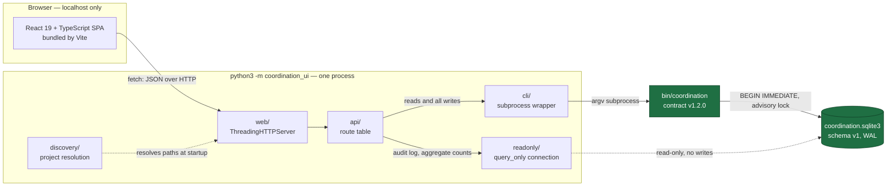
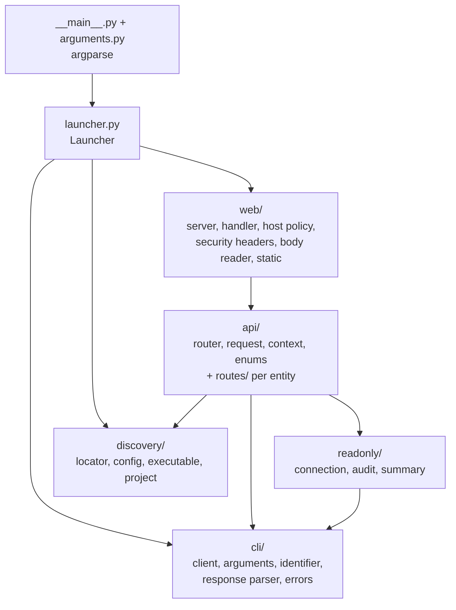
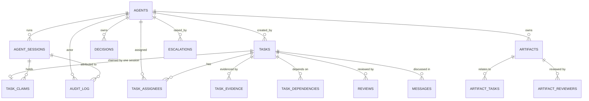
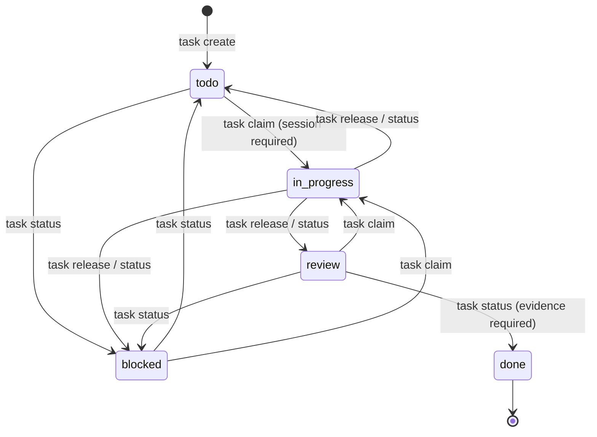
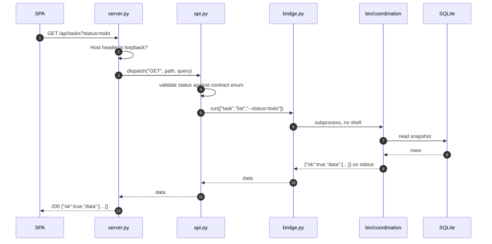
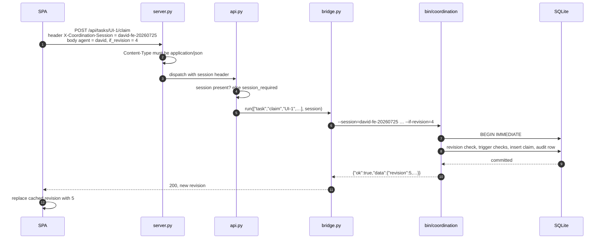
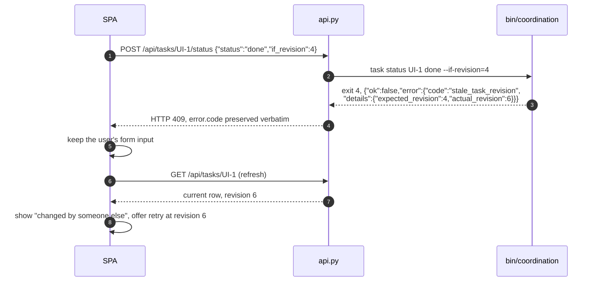
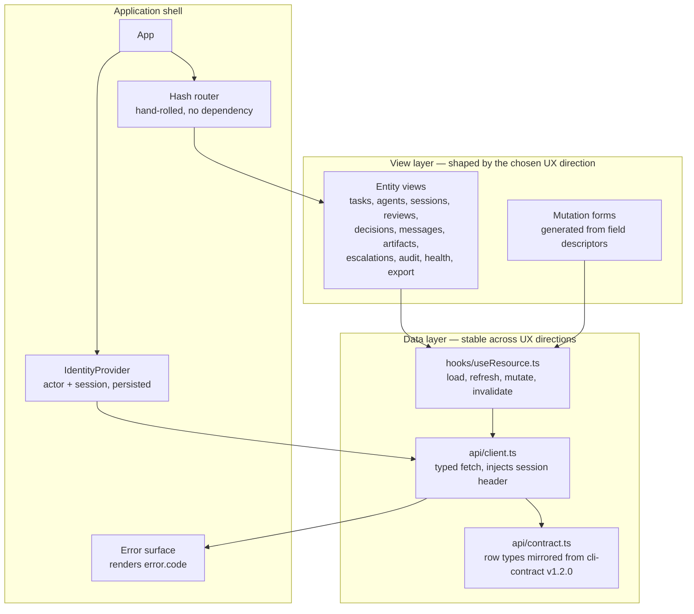
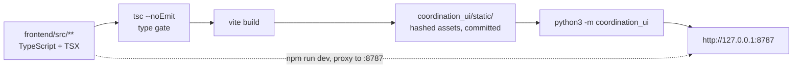

# Coordination Console — Component Design

| Field | Value |
| --- | --- |
| Status | Implemented: backend and React console both shipped and verified |
| Owner | `david` — Principal Software Development Engineer (Frontend) |
| Tracked by | `UI-1`, `UI-2`, `UI-3`, `UI-5` |
| Decisions | `FE-STACK-1` (React + Vite + TypeScript) |
| Reviews | `FE-ARCH-REVIEW-1` (UX spec feasibility, conditionally accepted) |
| Contract of record | `.agents/agentic-project-scaffold-lite/docs/cli-contract.md` v1.2.0 |
| Schema of record | `.agents/agentic-project-scaffold-lite/sqlite/schema.sql` v1 |

## 1. Purpose and scope

A local, browser-based console for the coordination database at
`.coordination/coordination.sqlite3`. It gives a human operator the view an
agent gets from `coordination task list` and friends — tasks, agents, sessions,
evidence, dependencies, reviews, decisions, messages, artifacts, escalations,
health, and the audit log — plus the ability to act on that state.

**In scope:** browsing every schema-v1 entity, performing every mutation the CLI
exposes, health and audit views, and the Markdown export.

**Out of scope:** `backup`, `restore`, and `init`. These are destructive or
filesystem-publishing operations whose failure modes need an operator at a
terminal reading exit codes, not a browser button. They stay CLI-only.

**Settled since first draft:** the visual system and page structure. `mikhail-ux`
published three directions under `UX-1`; the Coordination Ledger layout with the
Flowline palette was selected and specified in
`ux-visual-interaction-spec.md`. `FE-ARCH-REVIEW-1` conditionally accepted it for
frontend feasibility with four required changes, three of which are data
availability limits recorded as `UI-5`:

1. list results carry no total count, so exact "showing N of M" is not renderable;
2. `task list` has no tag or blocked-state filter;
3. `message list` filters by recipient only, so the inspector has no per-task
   message source;
4. white on `violet-500` measures ~4.1:1, under WCAG AA for button labels.

Section 7 still describes the layer boundaries rather than the visual system,
because those boundaries are what keep the selected direction — or a later
revision of it — cheap to apply.

## 2. Constraints that shape the design

| # | Constraint | Source | Consequence |
| --- | --- | --- | --- |
| C1 | `.coordination/coordination.sqlite3` must not be edited directly | `AGENTS.md` | Every mutation shells out to `bin/coordination` |
| C2 | The CLI contract is the machine interface; branch on `error.code` | `AGENTS.md` | Error codes survive the HTTP hop unmodified |
| C3 | Python 3.10+, no third-party runtime dependencies | cli-contract §Supported Environment | Server is stdlib-only |
| C4 | One local machine, trusted local OS users, no network sync | cli-contract §Supported Environment | Loopback bind, no auth, no CORS |
| C5 | No secrets, credentials, customer or regulated data | `AGENTS.md` | No credential inputs anywhere in the UI |
| C6 | Optimistic concurrency via `--if-revision` | cli-contract §Tasks | UI must carry and reconcile revisions |
| C7 | Mutations need an accountable actor; some need an active session | cli-contract §Actor And Session Semantics | Identity is first-class in the UI, not a hidden default |

## 3. System architecture

Two paths reach the database and they are deliberately asymmetric:

- **The CLI path carries every write and almost every read.** The CLI owns
  validation, identifier grammar, locking, revision checks, transition rules,
  and audit attribution. Reimplementing any of that in the server would create a
  second source of truth that drifts.
- **The read-only path exists because the CLI has no equivalent command.** There
  is no `coordination audit` and no aggregate-count command, so the audit
  timeline and dashboard tiles open the database directly. That connection is
  opened `mode=ro` **and** pinned with `PRAGMA query_only = ON`, so it cannot
  write even if a future bug tried to.

### 3.1 Python package dependencies

Packages depend strictly downward; there are no cycles. `cli/client.py` is the
only module that spawns a process, and `readonly/connection.py` is the only
module that opens a SQLite connection.

Each file holds one class and stays under 200 lines, so every unit is
importable and testable in isolation. The counts below are the shipped state.

| Package | Files | Responsibility |
| --- | ---: | --- |
| `cli/` | 9 | Run `bin/coordination`; build argv; parse its contract |
| `discovery/` | 6 | Resolve project, config, database, executable |
| `readonly/` | 5 | `query_only` audit and aggregate reads |
| `api/` | 6 + 10 routes | Route table; one handler per CLI command |
| `web/` | 7 | HTTP, loopback policy, CSP, static serving |
| root | 4 | Package metadata, argparse, launcher, entry point |

## 4. Component responsibilities

### 4.1 `discovery/`

Resolves *which project the UI serves* before anything else runs: walks up from
the working directory to the nearest `.coordination/config.yml`, validates
`version: 1` and `backend: sqlite`, and resolves the configured database beneath
that `.coordination/` directory. It re-implements only the subset of the
contract's discovery rules needed to answer that question; the CLI revalidates
every path it touches, so this module is a locator, not a gatekeeper.

Also resolves the executable: `$COORDINATION_BIN`, else
`.agents/agentic-project-scaffold-lite/bin/coordination`.

### 4.2 `cli/`

The single choke point for CLI invocation.

- Builds argv as `[executable, --db=…, --session=…, *command]`.
- **Every option is emitted as one `--flag=value` token.** Split into two
  tokens, a value beginning with `-` would be parsed as an option by the CLI's
  own argparse. Joined, it cannot be.
- **Every identifier is validated against the contract's grammar** before it
  reaches argv (`^[A-Za-z0-9][A-Za-z0-9._:@+-]{0,127}$`). Positional arguments
  cannot use the `=` form, so the leading-alphanumeric rule is what guarantees a
  task ID can never be read as a flag.
- Parses `{"ok": true, "data": …}` from stdout, or `{"ok": false, "error": …}`
  from stderr, into a `CoordinationError` carrying `code`, `message`, `details`,
  and the exit code.
- `run_text()` exists for the one command whose success output is not JSON:
  `export` without `--output`.

No shell is ever involved: `subprocess.run` receives a list, `shell=False`.

### 4.3 `readonly/`

Two queries the CLI cannot serve: the filtered audit timeline (with total count
and facet values) and the dashboard summary (per-table counts, task status and
priority histograms, per-agent workload, recent audit entries). The summary runs
all of its statements on one connection so the tiles are mutually consistent.

### 4.4 `api/`

A flat route table. Each handler is a mechanical translation of exactly one
documented CLI command — it appends options and returns the CLI's `data`
untouched. Handlers hold no coordination semantics of their own; the three
client-side pre-checks that exist (`claim` requires a session, `assign` requires
non-overlapping add/remove, `update` requires one content field) exist only to
produce a better message than a generic argparse failure, and the CLI still
enforces all three.

### 4.5 `web/`

`ThreadingHTTPServer` so a slow CLI call cannot block the whole UI. Serves the
Vite build output from `coordination_ui/static/` and the `/api/` surface.
Security posture in section 8.

## 5. Data model

Schema v1, abbreviated to the relationships the UI navigates:

`task_claims` is the interesting one: it is `PRIMARY KEY (task_id)`, so a task
has at most one claim, and database triggers require that claim to reference an
*active* session belonging to the *same* actor. That is why the console treats
"who am I" and "which session am I in" as two separate pieces of UI state.

### 5.1 Task lifecycle

Two rules the UI must render rather than discover by failing:

- `in_progress` is reachable **only** through `task claim`. A status button that
  targets `in_progress` returns `task_claim_required`, so the UI must offer
  "Claim" instead.
- `done` requires at least one evidence row. The UI disables the control and
  explains why when `evidence_count` is `0`.

Leaving `in_progress` requires the acting actor *and* the active session to own
the claim, which is why identity is in the header rather than buried in a form.

## 6. Request flows

### 6.1 Read

### 6.2 Write, with identity attribution

The session travels as a header rather than in each body so that no handler can
forget it and no form field can silently disagree with the header bar.

### 6.3 Failure and revision conflict

Losing typed input on a conflict is the failure mode worth designing against:
another agent commits between load and submit, and that is normal in this
system, not exceptional.

### 6.4 Exit code to HTTP status

Mapping lives in one table in `cli/exit_codes.py`. `error.code` is never rewritten —
the UI branches on the code, and the status line is only for HTTP semantics.

| CLI exit | HTTP | Meaning | Representative codes |
| ---: | ---: | --- | --- |
| 0 | 200 | Success | — |
| 1 | 500 | Unexpected internal failure | `internal_error` |
| 2 | 400 | Invalid arguments or missing attribution | `invalid_arguments`, `invalid_actor`, `session_required`, `task_claim_required` |
| 3 | 404 | Absent entity or database | `not_found`, `database_not_found` |
| 4 | 409 | State or uniqueness conflict | `stale_task_revision`, `task_already_claimed`, `invalid_task_transition`, `constraint_violation` |
| 5 | 500 | Installation, schema, database, filesystem | `configuration_error`, `database_corrupt`, `coordination_invariant_violation` |
| 6 | 503 | Lock or busy timeout | `database_busy` |

## 7. Frontend architecture

Per `UX-1-HANDOFF-1`, this section defines **module boundaries and data flow
only**. Every box below is independent of visual treatment; a UX direction
changes the view layer and the token file, not the layers beneath.

**Dependency budget.** `react`, `react-dom`, and — as build-time only — `vite`,
`typescript`, `@vitejs/plugin-react`. No router library (hash routing over a
single served `index.html` is a few dozen lines), no state library (server state
is the only state; a `useResource` hook covers it), no component library (a UX
direction is pending and a library would prejudge it). Adding to this list is an
architecture decision, not a commit.

**Why a typed contract module.** The ~20 endpoints return row shapes that are
contractual but not machine-readable. `api/contract.ts` mirrors the "Common Row
Shapes" table by hand. The contract remains the authority — the types are a
convenience that must be updated when the contract version changes, and
`FE-STACK-1` records that obligation explicitly.

**Identity is application state, not form state.** The header holds the acting
actor and the active session. Every mutation reads from there, so a user cannot
submit a form attributed to one actor while their session belongs to another —
the `session_actor_mismatch` conflict becomes unreachable by construction rather
than reported after the fact.

**Accessibility floor**, independent of the visual direction: every control
reachable and operable by keyboard, visible focus, form controls with associated
labels, errors announced via a live region, no color-only status encoding, and
WCAG 2.1 AA contrast. These are acceptance criteria on `UI-2`, not polish.

## 8. Security model

The contract's environment is one machine and trusted local OS users, so the
console does not authenticate. What it does do:

| Control | Rationale |
| --- | --- |
| Bind `127.0.0.1` only; non-loopback binds rejected in code | Unauthenticated mutating state must not reach a LAN |
| `Host` header must be a loopback name | Blocks DNS rebinding from a page in the same browser |
| `Content-Type: application/json` required on POST | A cross-site HTML form cannot set it without a preflight, and no CORS headers are ever sent |
| Strict CSP: `default-src 'none'`, `script-src 'self'` | Bundled assets only; no CDN, no inline script, no exfiltration channel |
| `nosniff`, `no-referrer`, `frame-ancestors 'none'` | Standard hardening |
| Static serving resolves and re-checks containment under `static/` | Path traversal |
| 2 MiB body cap, 30 s CLI timeout | Bounded resource use |
| No credential, token, or payment inputs anywhere | Constraint C5 |

**Residual risk, stated plainly:** any process running as this OS user can reach
the port and mutate coordination state as any actor it names. That is the same
authority the CLI already grants that user. The console does not widen it, and
it does not defend against a hostile local user.

## 9. Build and distribution

The build output is committed. A clean checkout runs the console with Python
alone — no Node, no `npm install`. The cost is that stale build output is
possible; `UI-3` covers a check that the committed bundle matches its sources.

## 10. Testing strategy

| Layer | Approach |
| --- | --- |
| `discovery/` | Temporary directory trees: valid project, missing config, malformed config, traversal attempts |
| `cli/` | Real CLI against a throwaway database; assert `--flag=value` tokenization and identifier rejection, including values beginning with `-` |
| `api/` | Route dispatch, enum validation, 405 vs 404, argument mapping per command |
| `web/` | Live loopback server: Host rejection, content-type rejection, traversal rejection, CSP headers present |
| Error mapping | Force each exit class and assert HTTP status and preserved `error.code` |
| Frontend | `tsc --noEmit` in CI plus unit tests for the API client and revision-conflict reducer |

Every test runs against a temporary database created with `coordination init`.
No test touches `.coordination/coordination.sqlite3`.

## 11. Open questions

| # | Question | Owner | Blocks |
| --- | --- | --- | --- |
| Q1 | Which of the three UX directions is selected? | `mikhail-ux` → user | View layer of `UI-2` |
| Q2 | Should `backup` be exposed read-only in the UI (path shown, not executed)? | `david` | Nothing; deferred |
| Q3 | Poll interval for live refresh, or manual refresh only? | UX direction | Minor; default manual + explicit refresh |

## 12. What this document does not authorize

It does not authorize direct writes to `coordination.sqlite3`, runtime network
access, CDN-hosted assets, relaxing the CSP, exposing the console beyond
loopback, adding frontend runtime dependencies beyond React and ReactDOM, or
treating the TypeScript row types as a substitute for the CLI contract. It also
does not constitute UX approval — the visual system remains `mikhail-ux`'s call
under `UX-1`, and release readiness remains a human decision.
