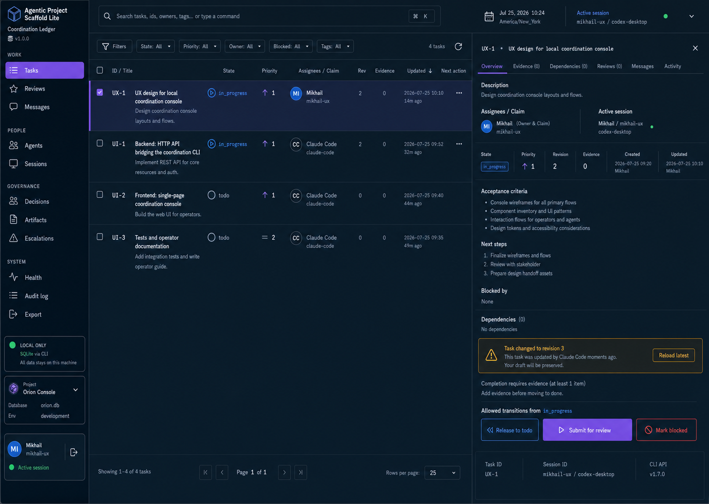

# Coordination Console — Selected UX Direction

| Field | Value |
| --- | --- |
| Status | Selected direction; ready for implementation review |
| Owner | `mikhail-ux` — UX Designer |
| Tracked by | `UX-1`; implementation in `UI-2`; startup identity in `UI-4` |
| Selected direction | Coordination Ledger layout + Flowline visual system |
| Visual target | `assets/coordination-console-ledger-flowline-selected.png` |
| Data-shape companion | `ux-data-shape-and-workflow-spec.md` |



## 1. Design intent

The console should feel like a dependable local operations instrument: precise
enough for technical users, understandable without SQLite knowledge, and calm
enough for repeated daily use.

The chosen direction combines:

- **Coordination Ledger's layout:** persistent navigation, dominant work queue,
  search and filters, and a simultaneous task inspector;
- **Flowline's visual language:** deep navy/slate surfaces, violet focus and
  primary actions, blue information, mint health, amber review, and coral
  blocking/error states.

The task queue is the hero surface. The UI does not lead with aggregate metrics
or advertise every database entity as a card.

## 2. Users and primary jobs

### Local operator

A human coordinating work across agents. Needs to see what requires attention,
inspect authority and evidence, and take a safe next action with clear
attribution.

### Agent-assisted operator

An AI or human-assisted role checking assigned work, claims, messages, reviews,
and blockers. Needs stable IDs, current revisions, exact allowed transitions,
and an auditable action path.

### Reviewer

A role-scoped reviewer inspecting an artifact and task evidence. Needs scope,
accepted items, required changes, risks, blocked claims, and follow-up work kept
distinct.

## 3. Application shell

### Left navigation

Width: `184–208px` desktop.

```text
Product identity
  Agentic Project Scaffold Lite
  CLI/schema version

Work
  Tasks
  Reviews
  Messages

People
  Agents
  Sessions

Governance
  Decisions
  Artifacts
  Escalations

System
  Health
  Audit log
  Export

Local-only connection
Project selector / diagnostics
Local operator and active session
```

The active destination uses a violet filled row, icon, and type weight. Color is
not the only active cue.

### Top bar

- Command/search field searches loaded task identifiers, titles, owners, and
  tags; a true cross-entity command palette is a future enhancement.
- Current date/time is secondary.
- Active actor and session are always visible.
- Identity bootstrap runs before mutation controls become enabled.

### Main queue

The task queue uses the largest share of horizontal space. Default columns:

```text
Select | ID / Title | State | Priority | Assignees / Claim | Rev |
Evidence | Updated | Next action | More
```

At widths where all columns do not fit, preserve this priority:

1. ID/title
2. state
3. owner/claim
4. next action
5. revision
6. evidence
7. priority
8. updated time

Hidden columns remain available in the task inspector; do not rely on horizontal
scroll for the primary workflow.

### Task inspector

Desktop width: `440–520px`.

Header:

- task ID and title;
- close control;
- status, priority, revision, evidence count, created/updated metadata.

Tabs:

```text
Overview | Evidence | Dependencies | Reviews | Messages | Activity
```

Overview includes description, assignees and claim, acceptance criteria, next
steps, blocked claims, and notes. Other tabs use the exact data shapes in the
companion specification.

The inspector footer contains:

- conflict or prerequisite messaging;
- actor/session attribution;
- only the valid next actions;
- diagnostic IDs in subdued monospace.

## 4. Visual system

### Typography

Primary stack:

```css
font-family:
  "Atkinson Hyperlegible Next",
  "Atkinson Hyperlegible",
  ui-sans-serif,
  system-ui,
  -apple-system,
  "Segoe UI",
  sans-serif;
```

The implementation may bundle Atkinson Hyperlegible locally. If adding the font
would violate the no-third-party/no-network constraint, use the system stack
without changing layout metrics materially.

Monospace stack, limited to identifiers, revisions, timestamps, session IDs,
and command-like values:

```css
font-family:
  ui-monospace,
  "SFMono-Regular",
  "Cascadia Mono",
  "Roboto Mono",
  monospace;
```

Type scale:

| Token | Size / line height | Weight | Use |
| --- | --- | --- | --- |
| `display-sm` | 24 / 32 | 650 | Page title only |
| `heading-lg` | 20 / 28 | 650 | Inspector title |
| `heading-md` | 16 / 24 | 650 | Section heading |
| `body` | 15 / 22 | 400 | Default content |
| `body-strong` | 15 / 22 | 600 | Row title, labels |
| `body-sm` | 13 / 19 | 400 | Secondary metadata |
| `code-sm` | 12 / 18 | 500 | IDs and revisions |

Do not reduce functional metadata below 12px.

### Color palette

Final contrast must be verified against the rendered implementation; these are
design targets, not untested compliance claims.

| Token | Hex | Use |
| --- | --- | --- |
| `shell-950` | `#07131F` | Navigation and outer shell |
| `surface-900` | `#0D1B28` | Primary work surface |
| `surface-850` | `#122333` | Inspector and elevated rows |
| `surface-800` | `#182C3E` | Hover/selected secondary surface |
| `line-700` | `#294054` | Dividers and input edges |
| `text-50` | `#F4F7FA` | Primary text |
| `text-200` | `#C8D2DC` | Secondary text |
| `text-400` | `#8FA1B2` | Quiet metadata |
| `violet-500` | `#8B5CF6` | Primary action and active navigation |
| `violet-400` | `#A78BFA` | Focus/hover highlight |
| `blue-400` | `#4DA3FF` | Informational and in-progress |
| `mint-400` | `#3DDC97` | Healthy and done |
| `amber-400` | `#F2B84B` | Review and warnings |
| `coral-400` | `#FF6470` | Blocked and destructive consequence |

Rules:

- Use violet for primary selection/action, not for every accent.
- Use mint only for positive state, not decoration.
- Use coral sparingly and never for neutral dismissal.
- Status always includes readable text and an icon/shape.
- Selected task row uses a violet leading rule plus a slate-violet surface; it
  must remain distinguishable in grayscale.

### Shape, spacing, and elevation

- Base spacing unit: `4px`.
- Common gaps: `8, 12, 16, 24, 32px`.
- Primary control height: `44px`.
- Compact table controls: minimum `36px`, with a `44px` interactive target when
  possible.
- Radii: `4px` for tags/compact controls, `6px` for inputs and action groups,
  `8px` maximum for panels.
- Shadows are reserved for overlay menus; structural separation uses surface,
  alignment, and dividers.
- No gradients, glass effects, decorative glow, or card-within-card layouts.

## 5. Core workflows

### 5.1 First launch

1. Show the shell in a non-interactive startup state.
2. Load project metadata and all agents.
3. Ensure `local-operator` exists as the active human actor through the
   CLI-backed API.
4. Start or select a matching active application session.
5. Show the resolved `Local Operator` and session in the shell.
6. Load queue and health data.
7. Enable mutation controls.

If identity bootstrap fails, reads may remain available, but mutation controls
stay disabled with a persistent setup recovery action.

### 5.2 Triage and inspect

1. Land on Tasks ordered by the contract's default priority/update ordering.
2. Filter by state, priority, assignee, blocked state, or tags.
3. Select a row to open its inspector without losing list context.
4. Review description, ownership, claim, acceptance, evidence, dependencies,
   reviews, and recent activity.
5. Choose the valid next action.

### 5.3 Claim work

1. Select a `todo`, `review`, or `blocked` task.
2. Choose `Claim task`.
3. Show the active actor/session and current revision.
4. Submit through `task claim`.
5. On success, update state to `in_progress`, revision, claim owner, and session.
6. On idempotent replay, show the already-claimed success state without a
   duplicate-success implication.

### 5.4 Submit for review

1. Select a task claimed by the current actor/session in `in_progress`.
2. Review evidence readiness and next steps.
3. Choose `Submit for review`.
4. Optionally add a transition note.
5. Submit the current revision.
6. On success, move to `review`, clear the active claim, and announce the new
   revision.

### 5.5 Mark done

1. Available only in `review`.
2. If evidence count is zero, show `Add evidence before marking done` and link
   directly to the Evidence tab.
3. If evidence exists, show actor/session attribution and the terminal effect.
4. Submit current revision.
5. On success, show `done` as terminal with no further status action.

### 5.6 Resolve a stale revision

1. API returns a stale-revision conflict.
2. Keep unsaved user input in memory.
3. Show old and latest revision when details provide them.
4. `Reload latest` fetches the current task.
5. Highlight fields that changed when comparison is available.
6. Let the user reconcile and explicitly submit again.
7. Never retry a stale mutation automatically.

### 5.7 Recover a stale session

1. Enter from Sessions or a health finding.
2. Explain that recovery blocks claimed tasks, increments their revisions,
   appends the reason, clears claims, and ends the session.
3. Require accountable actor and recovery reason.
4. Confirm with consequence-focused copy, not a generic `Are you sure?`.
5. Show the returned recovered task IDs and their new blocked status.

## 6. Component behavior

### Task state indicator

| State | Color | Icon concept | Plain-language label |
| --- | --- | --- | --- |
| `todo` | neutral | open circle | To do |
| `in_progress` | blue | play/triangle | In progress |
| `review` | amber | hourglass | In review |
| `blocked` | coral | barred circle | Blocked |
| `done` | mint | check circle | Done |

Stored values remain visible in diagnostic contexts; primary UI labels use
readable language.

### Priority

Priority is never encoded by color alone:

```text
1 Highest
2 High
3 Medium
4 Low
5 Lowest
```

The queue may show the integer plus arrow/line icon; tooltips and accessible
names provide the verbal label.

### Empty states

Empty states state what is absent and the next relevant action:

- `No tasks in review` → no action unless the operator can submit owned work;
- `No evidence yet` → `Add evidence`;
- `No active escalations` → no decorative success illustration;
- healthy system → concise check and last refresh time.

### Loading and refresh

- Preserve the shell and column widths during loading.
- Use text/skeleton rows that do not resemble real records.
- Refresh individual entities after mutations; avoid blanking the whole app.
- Show last successful refresh and retry for CLI/busy failures.

## 7. Responsive behavior

### Wide desktop: `≥1280px`

Navigation, queue, and inspector remain visible simultaneously.

### Compact desktop/tablet landscape: `900–1279px`

- Navigation collapses to icons with accessible labels/tooltips.
- Inspector becomes a modal side sheet over the queue.
- Low-priority columns move into the inspector.

### Narrow: `<900px`

- List and detail become sequential routes/views.
- Navigation becomes a dismissible drawer.
- Table becomes structured rows; do not squeeze the desktop table.
- Mutation actions remain in normal document flow rather than a permanently
  fixed bottom bar that could obscure content.

The console is desktop-first; narrow support preserves functionality but does
not mimic a consumer mobile application.

## 8. Accessibility requirements

- Target WCAG 2.2 AA.
- Full keyboard navigation for shell, queue, inspector tabs, forms, menus, and
  dialogs.
- Visible focus indicator with at least a 2px high-contrast outline.
- Logical focus movement: selected row → inspector heading; close → originating
  row; successful mutation → updated status announcement.
- `aria-live="polite"` for successful status changes and refreshed counts;
  assertive announcements only for blocking errors.
- Table headers and row relationships remain programmatic on desktop.
- Tabs implement the tabs pattern; side-sheet/dialog variants trap and restore
  focus appropriately.
- Color never carries status alone.
- Error copy identifies the field/action and recovery step.
- Support 200% browser zoom without lost actions or overlapping regions.
- Respect reduced motion; transitions are brief opacity/color changes only.
- Do not use hover as the sole way to reveal a required action.

## 9. Content guidance

- Prefer verbs that match the CLI consequence: `Claim task`, `Submit for
  review`, `Release to todo`, `Mark blocked`, `Mark done`.
- Use `Local Operator`, not `You`, until personalized.
- Distinguish assignee from claim owner.
- Use `Evidence required before completion`, not `Task incomplete`.
- Use `Reload latest; your draft will be preserved` for revision conflict.
- Avoid database jargon in primary flows. IDs and revisions remain available
  because they affect correctness.

## 10. Implementation handoff boundaries

This visual target controls layout hierarchy, palette, typography intent,
interaction order, accessible state communication, and responsive behavior.
The live application must use the API's current data and the exact shapes in
`ux-data-shape-and-workflow-spec.md`.

The mock image is not authoritative for:

- record counts, timestamps, assignees, evidence, or revisions;
- CLI/schema version;
- filesystem paths;
- unsupported transitions or mutations;
- accessibility conformance before rendered verification.

UX acceptance requires comparison against the selected target at the same
desktop viewport, plus keyboard, contrast, zoom, state, and data-shape checks.

